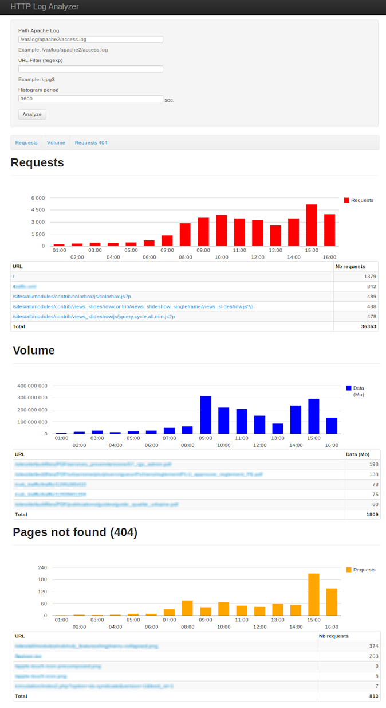

HTTP Log Analyzer
=================

Analyze HTTP logs and display histograms and stats about the requests, in order to identify main problematic urls.

Statistics includes:
 * URLs
 * 404 pages
 * Volume
 * IP
 * User Agents

Installation
------------

Donwload the code or use the git repository.

The default install is configured to read the default combined Apache2 log format, but you can adjust the parser by editing config.inc.php

You can also set other options in config.inc.php

The, with your browser, open the index.php.

Note: currently, you can not upload the log file, you can only parse local log files.
